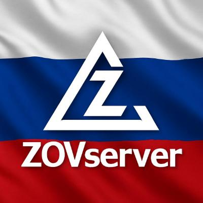
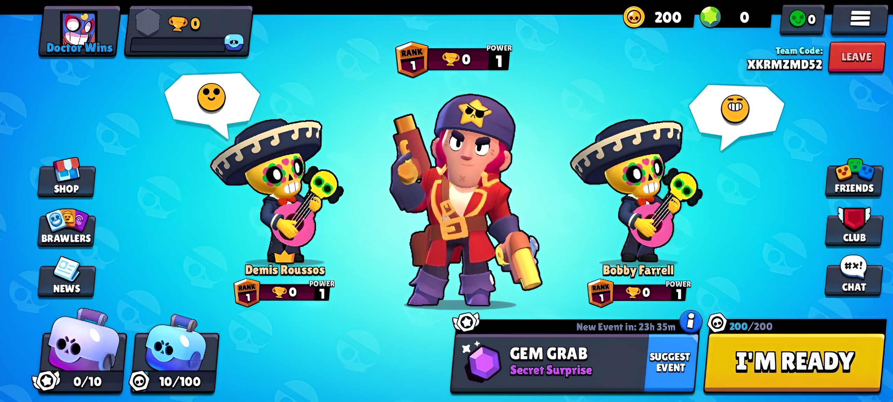
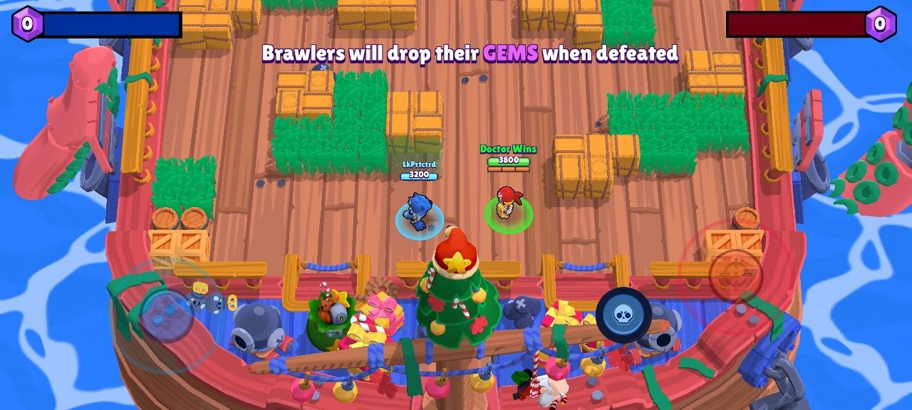

#
<p align="center">
  
</p>


**ZOVserver** is the world's first fully open-source private server emulator for Brawl Stars V24, built on the **.NET 10** platform and the **Microsoft Orleans** actor model.

Unlike traditional monolithic emulator architectures, ZOVserver offers an uncompromising approach: a total separation of business logic into microservices, strict typing, zero-allocation paradigms in critical execution paths, sophisticated routing, and support for cutting-edge databases. When properly configured in a cluster, it stands as the most fault-tolerant server in the world, featuring best-in-class defense against automated bot request floods, with seamless support for hot horizontal and vertical scaling.

---

## What's Already Implemented?
* Absolutely all of Brawl Stars V24's lobby functionality.
* The core of the battle system (battle loading, battle spectating, basic movement logic)

### Screenshots

<div align="center">
  
  
</div>

---

## Table of Contents

* [Key Architectural Paradigms and Technology Stack](#key-architectural-paradigms-and-technology-stack)
    * [Database and Caching Foundation](#database-and-caching-foundation)
    * [Telemetry, Monitoring and Discovery](#telemetry-monitoring-and-discovery)
* [Detailed Breakdown of the Microservices Domain (src/)](#detailed-breakdown-of-the-microservices-domain-src)
    * [1. Network Gateway (Gateway Layer)](#1-network-gateway-gateway-layer)
    * [2. Scalable Game Services (Game Silos)](#2-scalable-game-services-game-silos)
    * [3. Extreme Battle Silos (Battle Silos)](#3-extreme-battle-silos-battle-silos)
    * [4. Global Services (Single-Instance)](#4-global-services-single-instance)
    * [5. Infrastructure Bridges (Shared Services)](#5-infrastructure-bridges-shared-services)
* [Libraries, Code Generation and Legacy (Shared)](#libraries-code-generation-and-legacy-shared)
* [Control Panel and Orchestration (Admin Panel & Bots)](#control-panel-and-orchestration-admin-panel--bots)
    * [Admin Panel (ZOVserver.AdminPanel)](#admin-panel-zovserveradminpanel)
    * [Telegram Orchestrators (ZOVserver.Orchestra)](#telegram-orchestrators-zovserverorchestra)
* [🚀 Deployment and Launch](#-deployment-and-launch)
* [Client Configuration and Patching (APK)](#client-configuration-and-patching-apk)
* [License and Disclaimer](#license-and-disclaimer)

---

## Key Architectural Paradigms and Technology Stack

The infrastructure is designed to handle hundreds of thousands of simultaneous connections. Every data and network-routing layer is strictly optimized for its specific task.

### Database and Caching Foundation
* **MongoDB**: Serves as the persistent `State` store (via `Orleans.Providers.MongoDB`) for players, clubs, teams, content creators, and so on.
* **Microsoft Garnet**: An ultra-fast in-memory store. Used exclusively for microsecond-scale operations: storing raw leaderboard indexes (ID:Trophies) and powering the in-lobby team-finding system.
* **Redis**: Storage for "enriched" data. Receives fully assembled top-player profiles from the worker processes across 266 geographic regions for instant delivery to the client.
* **etcd**: A smart storage layer. Used to synchronize global promotions (Offers) across all running `HomeService` instances in the cluster via the `WatchRangeAsync` and `GetRangeAsync` mechanisms.
* **NATS**: A high-performance message bus. Responsible for the instant synchronization of events (game modes) across all nodes.
* **OpenSearch**: A search cluster with custom DSL queries. Provides fuzzy club search using sophisticated ranking algorithms and prefixes.

### Telemetry, Monitoring and Discovery
* Orleans cluster topology maintenance is available via either **Consul** (default) or **ZooKeeper**.
* Internal .NET and Orleans metrics (via `Prometheus-net`) are collected by the **Mimir** server and visualized in **Grafana**.
* **SeaweedFS** is integrated as a modern distributed file system for metrics.

---

## Detailed Breakdown of the Microservices Domain (`src/`)

#### **`ZOVserver.DistFiles.FileServer`**: A foundational gRPC microservice running as a single instance. Acts as the global file server, distributing settings to all microservices, along with localization and static game assets.

### 1. Network Gateway (Gateway Layer)
**`ZOVserver.Bridge.TcpProtocolBridge`**
An asynchronous TCP bridge built on the high-performance **DotNetty** framework.
* **Anti-DDoS:** The bridge doesn't just forward connections - it also acts as an L7 filter. When a suspicious traffic spike is detected (N connections to a port within 60 seconds), a custom self-protection trigger fires, temporarily halting new incoming connections on the targeted port and protecting the internal Orleans cluster from thread starvation.
* **Rasputin-Protect:** Protection against bot requests and attempts by attackers to analyze the network architecture.
* **Communication:** Packets of the Laser protocol are parsed on the fly. Incoming requests are routed to Grains via the `Orleans Client`, while the asynchronous return delivery of packets from grains to the bridge is handled through the `Orleans Observer` mechanism. Direct routing from the Bridge is permitted only to three entry-point services: `PlayerSessionService`, `HomeService`, and `FriendshipService`.

### 2. Scalable Game Services (Game Silos)
A group of services designed to run in parallel across multiple instances.
* **`ZOVserver.Services.Game.PlayerSessionService`**: The session lifecycle control service. Handles account generation and verification, as well as cryptographic validation of the hashed `passToken`. Responsible for the Lock/Ban system: a Locked account enters a special waiting state - if the user knows the unique code issued by an administrator and enters it, the account is unlocked; a Banned account is unlocked automatically once the ban period expires.
* **`ZOVserver.Services.Game.HomeService`**: The core of the business logic and the largest node in the project. Handles the generation of personalized promotions, calculates the reward-drop entropy for Brawl Boxes, and manages gifts and offers. If a request falls outside its scope, it proxies it to `AllianceService` or `TeamService`.
* **`ZOVserver.Services.Game.FriendshipService`**: The friendship-graph node. Handles incoming friend requests, generates friends lists, and tracks online/offline presence status.
* **`ZOVserver.Services.Game.TeamService`**: Isolated logic for in-game Teams. Autonomously manages everything within a game room.
* **`ZOVserver.Services.Game.AllianceService`**: Business logic for Alliances (clubs). Transactionally manages roles, club trophies, and club state, while writing its data in parallel to the search indexes and Garnet leaderboard tables.
* **`ZOVserver.Services.Game.ContentCreatorRewardService`**: A monetization and creator-support service. Receives triggers not from the TCP bridge but from the Telegram orchestrator. Handles crediting a share (gems) to content creators' accounts whenever their code is activated by players during in-game purchases.
* **`ZOVserver.Services.Game.MatchmakingService`**: The matchmaking balancer. Applies complex algorithms to solve binary-optimization problems in order to group players into sessions. It accounts for trophy spread, the presence of pre-formed teams, and strictly prevents under- or over-filled matches, assembling ideal matches before sending them to `BattleService`. A timer can optionally kick in during low online periods, after which the battle will start even if the required number of players hasn't been reached.

### 3. Extreme Battle Silos (Battle Silos)
**`ZOVserver.Services.Game.BattleService`**
The most technically complex and high-load node in the cluster. It's an Orleans silo, but internally hosts **UDP battle servers**. Battle state is kept exclusively `InMemory`.

* **Zero-GC & Marshalling:** To eliminate "stutters" caused by the .NET Garbage Collector, all battle code is written to GC-friendly standards. It makes heavy use of `unsafe` blocks, raw memory pointers, `struct` types, `ArrayPool`, and `Span<T>`.
* **LogicLooper:** All battle context, movement physics, collision, and damage calculations run in a strict game loop at **20 ticks per second**, built on top of the powerful `Cysharp.LogicLooper` library.
* **Scale:** A single battle is represented by a single Orleans grain, but just one UDP server instance is capable of asynchronously routing traffic for tens of thousands of such grains.
* **Cryptography:** An ultra-fast implementation of the encryption protocol applied to every packet sent over the Datagram (UDP) channel.

### 4. Global Services (Single-Instance)
Services that are strictly permitted to run as only a single instance in order to avoid race conditions:
* **`ZOVserver.Services.Global.GameGlobalEventsService`**: The server's "director." Responsible for global state flags: switching gamemodes, box-opening availability, shop states, trophy seasons, and maintenance breaks. Synchronizes its changes across all Game Silos and Bridge via NATS.
* **`ZOVserver.Services.Global.LeaderboardEnrichmentService`**: The leaderboard-enrichment daemon. Runs a complex assembly pipeline: on a schedule, it queries `Garnet` to pull the leading `ID:Trophies` pairs, then queries `HomeService` to load full player profiles or `AllianceService` to load club headers, and writes the finished data to `Redis`. The process repeats for **266 regions** across three independent categories: Players, Clubs, and Brawlers.

### 5. Infrastructure Bridges (Shared Services)
**(Requires publishing to NuGet to keep versions in sync)**

An abstraction layer used by a handful (2-3) of Game nodes. They're "shared" because they allow database-access logic to be reused while keeping the calling services fully encapsulated:
* **`ZOVserver.Services.Shared.AllianceSearchService`**: The club search engine. Issues complex queries to the **OpenSearch** cluster. The search algorithm uses boost factors for optimal relevance:
    * An exact match (the `raw` suffix) receives the maximum `Boost = 20`.
    * A prefix match (`MatchPhrasePrefix`) receives `Boost = 10`.
    * Fuzzy search (tolerating typos) via Damerau–Levenshtein distance (`Fuzziness.EditDistance(2)`) receives `Boost = 5`.
    * *Used in: `HomeService` (for reading search results) and `AllianceService` (for writing and updating indexes).*
* **`ZOVserver.Services.Shared.GarnetLeaderboardsService`**: The interface for interacting with Microsoft Garnet. Responsible for atomic reads and writes of trophy scores.
    * *Used in: `LeaderboardEnrichmentService` (read), `HomeService` (write), `AllianceService` (write).*
* **`ZOVserver.Services.Shared.TeamPlayersSearchService`**: Implements the team-finding mechanic. Also built on `Garnet`, thanks to its microsecond read/write latency and mature atomicity guarantees.
    * *Used in: `HomeService` (fetching available teams) and `TeamService` (writing teams that are ready to accept players).*

---

## Libraries, Code Generation and Legacy (`Shared`)
**(Requires publishing to NuGet to keep versions in sync)**

The `src/shared/` directory (not to be confused with `Services.Shared`) contains the foundational projects that the entire server is built on:

* **`ZOVserver.Shared.Contracts`**: Defines all RPC contracts for Orleans and the `Laser` protocol structures.
* **`ZOVserver.Shared.Contracts.Generator`**: A powerful .NET Source Generator. Runs at compile time, scanning C# message and command classes (marked with the `[LaserSerializable]` attribute) and automatically generating high-performance `Encode`/`Decode` methods - completely eliminating slow runtime Reflection and manual serialization code from the server.
* **`ZOVserver.Shared.Contracts.Proto`**: Defines the `.proto` files used for inter-service gRPC communication.
* **`ZOVserver.Shared.Localization`**: A centralized project for managing server localization across every language supported by the Brawl Stars client.
* **`ZOVserver.Shared.TitanRemnants`**: The highlight of the codebase. The remnants of the original *Titan* game engine, fully reverse-engineered and rewritten in modern C#. Includes:
    * Ultra-fast `ByteStream` and `BitStream` implementations for working with binary streams. A benchmark confirming the superiority of this implementation is available in the [ZOVserver.Basic.Titan.Streams](https://github.com/ZOVserver/ZOVserver.Basic.Titan.Streams) repository.
    * The innovative `PAssets` approach for lightning-fast parsing of in-game CSV assets, with highly optimized usage.
    * Math utilities and helpers.
---

## Control Panel and Orchestration (Admin Panel & Bots)

To ensure maximum security, the server has no built-in administrative commands in the in-game chat. All management is handled through external RPC interfaces:

### Admin Panel (`ZOVserver.AdminPanel`)
* **Frontend:** Written in Python using the **Flet v0.23.0** framework.
* **Backend:** Written in C# and communicates over gRPC.
* **Communication:** The frontend calls the backend's methods over gRPC, which in turn issues `Orleans Client` requests.
* **Capabilities:** Real-time cluster metrics viewing, issuing Locks/Bans, crediting gifts to accounts, sending in-game messages (Inbox), and dynamically creating promotions (`Offers`) on the server without restarting the cluster.

### Telegram Orchestrators (`ZOVserver.Orchestra`)
Interactive management of business entities directly from the messenger:
1. **`ContentCreatorsBotOrchestrator`**: A Telegram bot for managing content creators. Lets administrators register new creator codes, assign payout tiers, and track transparent statistics on player donations (linked to `ContentCreatorRewardService`).
2. **`GameGlobalEventsBotOrchestrator`**: A bot that performs remote gRPC calls to the `GameGlobalEventsService` singleton. Lets administrators add new game events, stop map rotation, close the shop, or block box openings, and trigger scheduled maintenance - all with a single command.

---

## 🚀 Deployment and Launch

**The entire external stack is deployed with a single command:**

1. Make sure ports `27017, 8500, 8600, 4222, 8222, 2379, 2380, 9333, 8333, 9009, 12345, 3000, 6380, 2181, 2182, 2183, 9005, 9200, 9300, 9201, 9301, 6191, 6194` are free.
2. The `docker/` folder contains a single **`docker-compose.yml`** that spins up the entire ecosystem: MongoDB, Redis, Garnet, OpenSearch, NATS, etcd, Consul, Mimir, SeaweedFS, and Grafana.
3. Start the infrastructure:
   ```bash
    docker-compose up -d
   ```

**Recommended order for the cluster's first launch:**

```
dist-files
services/game
services/global
bridge
admin-panel
orchestra
```

---

## Client Configuration and Patching (APK)

APK: https://github.com/ZOVserver/ZOVserver/releases/download/V24/ZOVclient_s2417.apk

The `libsettings.so` file is generated using `settings_creator.py` in the `client/` directory.

### Configuration Options
* **Adding Servers and Ports:**
    * **Specific ports (`.add`):** Attach individual ports to an IP address (e.g., `servers.add("192.168.0.10", "9339,9449")`).
    * **Port ranges (`.addRange`):** Assign a range of sequential ports to an IP address (e.g., `servers.addRange("172.17.64.1", 9006, 9099)`).
    * **Method chaining:** You can chain multiple `.add()` or `.addRange()` calls together on the same `Servers()` instance.
* **Loading Screen Text (`watermark`):**
    * Display a custom loading screen message instead of the default *"Connecting to server..."* (e.g., `watermark = "Welcome to ZOVserver client!"`).
    * To keep the default game text, set `watermark` to an empty string (`""`), `"none"`, or `"null"`.

### Package Name Restriction
* The package name **MUST** start with the prefix **`org.zovserver.`** (otherwise the application will fail to launch).
* After the dot, any unique words or identifiers of your choosing are allowed.
    * **Correct:** `org.zovserver.mybrawl`, `org.zovserver.medved`, `org.zovserver.pvp`
    * **Incorrect:** `com.brawlstars.zov`, `org.zov.server`

---

## License and Disclaimer

This project is distributed under the **MIT** license.

**Disclaimer:**
ZOVserver is an open-source emulator created for educational and research purposes. It is **not affiliated with, endorsed by, or sponsored by Supercell Oy** or its subsidiaries. All trademarks, characters, and assets from *Brawl Stars* belong to Supercell. The project does not contain any proprietary game files; a legitimate copy of the client is required to use it.

**Financial Support:**
Development of ZOVserver was made possible through **direct financial support from Microsoft**. We're grateful to them for the grants and sponsorship that allowed us to build this architecture on cutting-edge technology. This does not, however, imply any official endorsement of or partnership with the companies mentioned - the project remains an independent, enthusiast-driven initiative.

**THE SOFTWARE IS PROVIDED "AS IS", WITHOUT WARRANTY OF ANY KIND**, express or implied, including but not limited to the warranties of merchantability and non-infringement. The authors are not liable for any damages arising from the use of this code.


# 🌟 Enjoyed the project? Give this repository a Star - it's the best motivation for us to keep developing ZOVserver!
